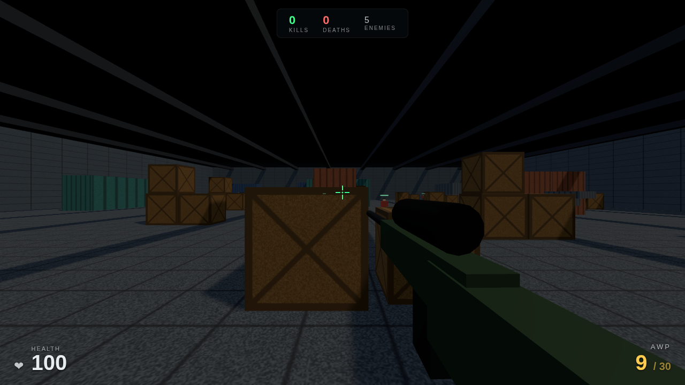
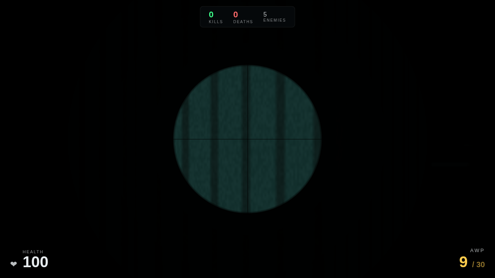
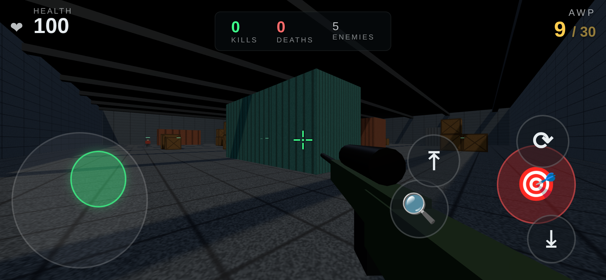

# 🎯 AWP HANGAR — CS Tarzı 5v5 Takım Deathmatch

Three.js ile yazılmış, tarayıcıda çalışan Counter-Strike esintili bir **5v5 takım deathmatch** oyunu.
Sen + 4 müttefik bot, 5 düşman bota karşı — botlar birbiriyle de çatışır. Kurulum yok — linke tıkla ve oyna.



Sağ tık ile AWP scope:



📱 Telefonda dokunmatik kontrollerle de oynanır:



## 🎮 Nasıl Oynanır

| Tuş | İşlev |
|-----|-------|
| **W A S D** | Hareket |
| **Fare** | Bak / nişan al |
| **Sol Tık** | Ateş (basılı tut = sprey / AWP tek atış) |
| **Sağ Tık** | Nişan / scope (basılı tut) |
| **1 / 2 / 3 / 4** | Silah: AK-47 / AWP / Deagle / Bıçak |
| **Q** | Önceki silaha hızlı geçiş |
| **R** | Şarjör değiştir |
| **F** | Müttefik komutu: takip et / serbest |
| **Tab** | Skor tablosu (basılı tut) |
| **Shift** | Yürü (yavaş) |
| **Space** | Zıpla (kasalara çık) |
| **Ctrl** | Çömel |
| **Esc** | Menü / duraklat |

Ekrandaki **OYNA** butonuna tıkla — fare kilidi devreye girer. Kafadan vuruş anında öldürür,
gövde vuruşu çok yüksek hasar verir. En yüksek K/D skorunu yakala.

### 📱 Telefonda (dokunmatik)

Telefonda otomatik olarak dokunmatik kontroller ve tam ekran devreye girer:

| Kontrol | İşlev |
|---------|-------|
| **Sol joystick** | Hareket (analog — az it = yürü, çok it = koş) |
| **Sağ tarafta sürükle** | Bak / nişan al |
| 🎯 | Ateş |
| 🔍 | Scope / zoom (aç-kapa) |
| ⟳ | Şarjör değiştir |
| ⤒ | Zıpla · ⤓ Çömel |

> En iyi deneyim için telefonu **yatay** tut. Dikey tutarsan uyarı çıkar.

## ⚙️ Özellikler

- **Dört silah:** **AK-47** (tam otomatik, sprey) · **AWP** (bolt-action, scope) · **Deagle** (güçlü
  tabanca) · **Bıçak** (2 kesişte kill, +%18 hız). 1-4 tuşları veya mobil buton; Q önceki silaha döner;
  her şarjör bağımsız.
- **Ateş & recoil:** tam-otomatik sprey (tetik basılı), silaha göre hasar/yayılım, sprey recoil (tırmanır +
  geri gelir), namlu alevi, hitmarker
- **5v5 takım savaşı:** sen + 4 müttefik (mavi) vs 5 düşman (kırmızı); botlar birbiriyle de savaşır,
  takım skorları HUD'da, dost ateşi kapalı
- **Bot AI + rig:** A* pathfinding ile engellerin etrafından rota, en yakın görünür düşmanı seçme (LOS raycast), yaklaşma/strafe, eklemli gövde (elde
  tüfek, hedefe nişan pozu, yürüme salınımı, devrilerek ölme), isimli can barları (Şahin, Kobra…)
- **Hangar harita:** konteynerler, kasa yığınları, rampalar, siperler — uzun snipe hatları + saklanma
- **CS hissi:** prosedürel dokular, gölgeli ışıklandırma, tavan kirişlerinden ışık huzmeleri
- **Round sistemi:** 20 kill'e ulaşan takım round'u alır; round sayacı ve kazanan banner'ı
- **HUD:** dinamik nişangah (sprey/hareketle açılır), radar (spotted düşmanlar), takım skorbarı,
  skor tablosu (Tab), kill feed (isimli, 💀 headshot ikonu), reload barı, hasar yön göstergesi,
  ölüm ekranı + 2 sn spawn koruması
- **Ayarlar:** hassasiyet, ses aç/kapa, bot zorluğu (Kolay/Orta/Zor) — hepsi kalıcı (localStorage)
- **Müttefik komutu:** F ile "beni takip et / serbest dolaş"
- **Ses:** WebAudio — silah sesleri, ayak sesleri, vızlayan mermi, headshot 'tink', kill onayı
- **Deathmatch:** sonsuz döngü, respawn

## 🚀 Çalıştırma

### Yerel (build gerekir)

```bash
npm install
npm run build      # dist/ üretir (esbuild → klasik-script/IIFE)
npm run serve      # dist'i http://localhost:8080 adresinde sunar
```

Başsız duman testi: `npm run bootgate` (oyunun gerçekten açıldığını doğrular).

### GitHub Pages (önerilen — linkten oyna)
`.github/workflows/pages.yml` `main` dalına her push'ta **build + boot-gate + deploy** yapar. Tek seferlik kurulum:

1. Repo **Settings → Pages** bölümüne git.
2. **Build and deployment → Source** kısmını **GitHub Actions** olarak ayarla.
3. `main` dalına push/merge yap — birkaç dakikada
   `https://<kullanıcı-adın>.github.io/cs/` adresinde yayında olur.

## 🛠️ Teknik

- **Three.js 0.160**, esbuild ile **klasik-script / IIFE** olarak bundle edilir (`dist/game-[hash].js`).
  CDN yok, importmap yok, inline module yok — **iOS Safari uyumlu** (bkz. `docs/…REHBERI.md` §3).
- `index.html` bir şablon; `build.mjs` hash'li script yolunu + sürümü enjekte eder.
- Sağlamlık: no-cache meta, yükleme katmanı, `#fatal` hata katmanı, `build vNN` rozeti.
- Fizik: AABB çarpışma + yerçekimi, adım (step) mantığıyla kasalara tırmanma.
- Bot AI: durum makinesi (patrol / engage) + LOS raycast.
- **Sevkiyat:** `bash ship.sh <sürüm> "mesaj"` — build → boot-gate → commit → push (FAIL ise push yok).

## 📄 Lisans

MIT
